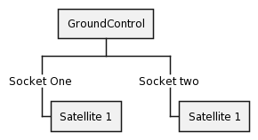
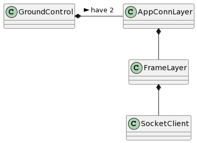
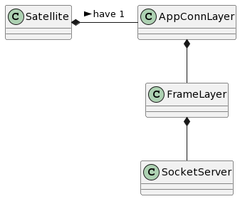

PREPARACION DE ENTORNO

* Os: Ubuntu 20.04
* Gcc -- version: 9.4.0

* Instalcion Build / Boost
```shell
sudo apt install build-essential libboost-system-dev libboost-thread-dev libboost-program-options-dev
sudo apt install libpthread-stubs0-dev
```

* Instalacion CMake
```shell
sudo apt install cmake
```

* Intalacion Gtest
```shell
sudo apt install libgtest-dev
cd /usr/src/gtest
sudo cmake CMakeLists.txt
sudo make
sudo cp lib/*.a /usr/lib/
sudo cp -r include/* /usr/include/
```

* Intalacion GMock
```shell
sudo apt install google-mock
cd /usr/src/gmock
sudo cmake CMakeLists.txt
sudo make
sudo cp lib/*.a /usr/lib/
sudo cp -r include/* /usr/include/
```

* Build (./src):
```shell
chmod +x ./build.sh
./build.sh 2> build.log
```

* UnitTest Gtest / GMock (./src):
```shell
chmod +x ./unitTest.sh
./unitTest.sh
```

* Run GrounControl / Satelite1 / Satelite 2 (./src):
```shell
chmod +x ./main.sh
./main.sh
```

EXPLICACION

La lógica de asignación de tareas es la siguiente:

El GS (GroundControl) recibe una lista de  tareas a realizar (addListTaskToDo(...) - Ver ./src/GroundControl/main/main.cpp):
El GS teniendo conocimiento de los recursos disponibles en cada satélite y los recursos necesarios para realizar cada una de las tareas evalúa todas las posibles opciones de asignación (que la tarea 1 sea asignada al satélite uno, que sea asignada al segundo satélite o a ninguno de los dos, y así con todas las tareas)
De esta manera se evalúan las 3 ^N (siendo N el número de tareas a asignar) posibles combinaciones obteniendo el pay off que se obtendría para cada posible asignación. Comenzando desde las combinaciones de mayor payoff se verifica la factibilidad de realizar dicha asignación. Si con los recursos disponibles en el satélite 1 y en el satélite 2 se podrán llevar a cabo las asignaciones que le corresponde a cada uno en dicha combinación.
En el momento que se verifica que una combinación es factible, dicha combinación se utiliza para separar la lista de tareas a realizar en 3 listas:

* Las tareas que se enviaran al satélite 1
* Las tareas que se enviaran al satélite 2
* Y las tareas que quedarán a la espera que se liberen nuevos recursos para verificar si es factible realizarlas.

Una vez definidas las tareas que se quieren enviar a cada satélite, se transmite la tarea al satélite, una a la vez, a través de un protocolo de comunicación mediante socket hacia las aplicaciones de cada satélite.

En cada satélite se simula un tiempo de duración aleatorio para cada tarea y, una vez concluido se decide al azar (con una probabilidad de éxito del 90%) si la tarea fue exitosa y se comunica dicho resultado a la GC.

En la medida que las tareas finalizan, liberando recursos, se dispara una nueva evaluación de las tareas en espera para volver a reasignar tareas, siempre optimizando el payoff como en la primera evaluación.

Ver documentacion de codigo (Doxygen).

DIAGRAMAS







TODO

Pasar documentacion a ingles.

